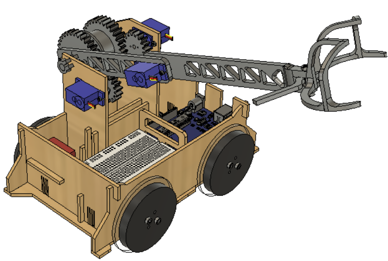
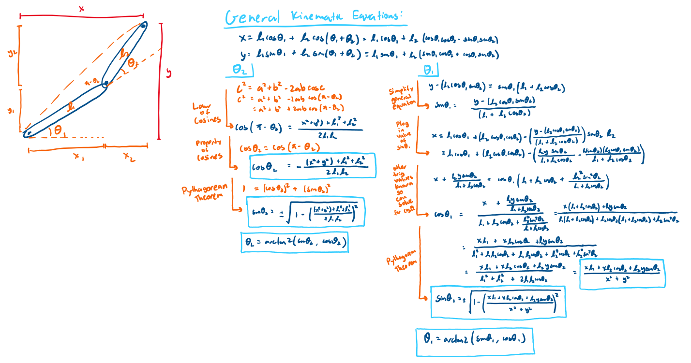
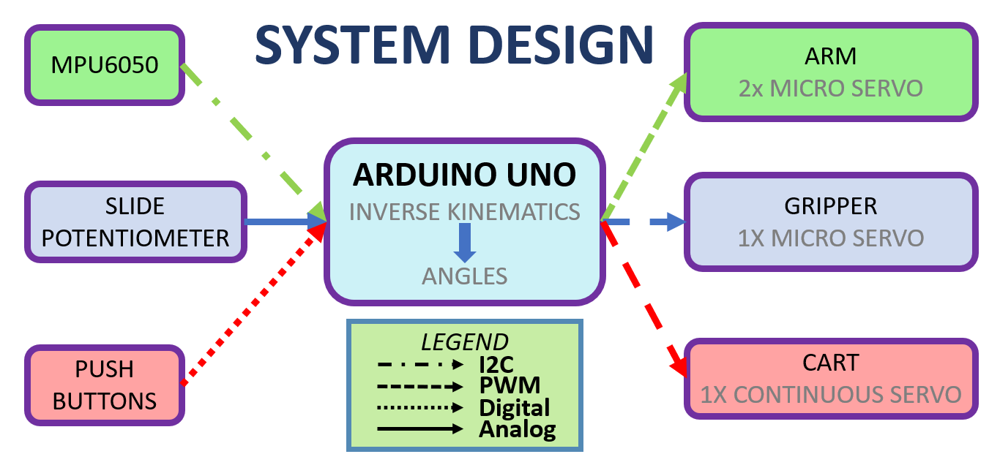
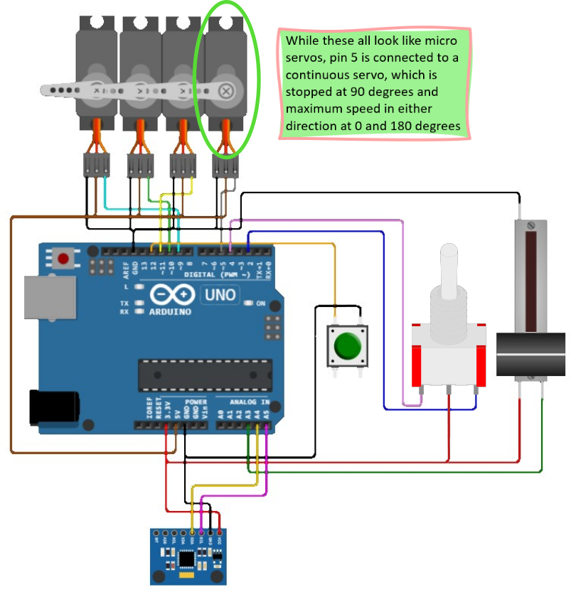
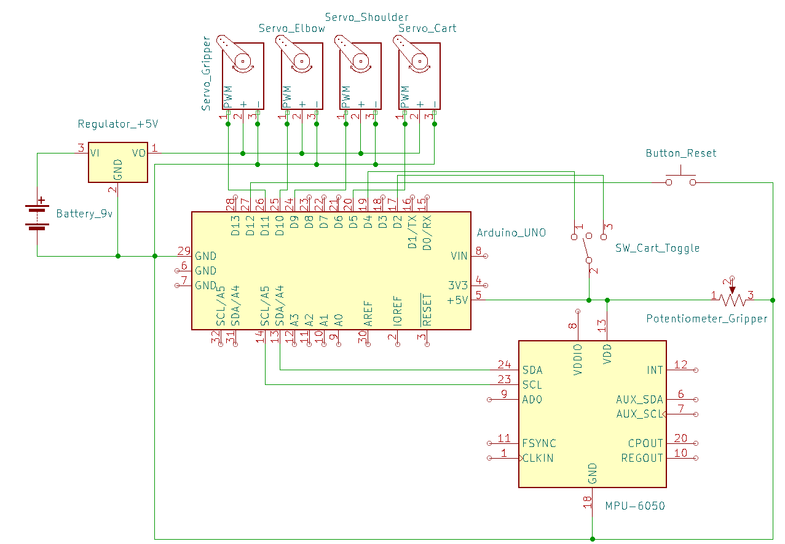
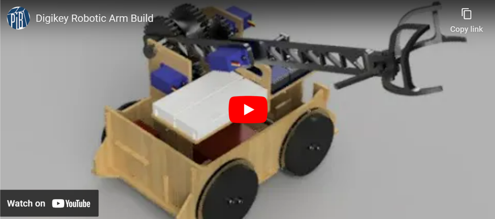
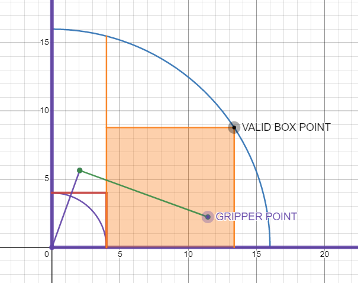

# Robotic Arm

## **PART 1: CONCEPTS**

### Inverse Kinematics
While it can take many forms, inverse kinematics is generally a mathematical system used to translate the coordinates of the space around the robot into values of angles and speed that it can comprehend. The inverse kinematics for the robot then becomes more complex as the number of joints, or degrees of freedom in movement, increases. Coordinates within the space around the robot may translate to many different values of angles for the robot, which then makes it necessary for the system of inverse kinematics to optimize the most efficient path. However, when the amount of degrees of freedom from the robot’s joints more closely match the dimensions of space around the robot, an equation that directly relates the coordinates to angles is available within closed-form inverse kinematics.

Within this project, a two link manipulator will be used to demonstrate fundamental concepts in deriving systems of inverse kinematics for robots. The manipulator’s two degrees of freedom occupies the two dimensional plane of space around it, so closed-form inverse kinematics can be used to explicitly define angular coordinates for a specific set of real world coordinates. Below is the derivation of the inverse kinematics equation used in the code [section five](#part-5:-code):

To sum it up, both the law of cosines and equations for forward kinematics were used to derive expressions for the sine and cosine values for the joint angles. When cosine was derived, the pythagorean theorem could be used to find the sine value, and vice versa. The sine and cosine values were then converted to angle values using the atan2 function. 

However, with the physical constraints of the length of the arm and the angles of rotation in the servos, this project also has a specific range of space it can act within (explained in more detail in section five). It should also be noted that having the angles of the joints at 0, or having the members completely in line, can also create confusion for the robot in its inverse kinematics calculations. These points are collectively defined as singularities, where the joints get “stuck” in place for reasons such as the specification of unreachable joint angles. 
### MPU6050
The MPU6050 is an inertial measurement unit (IMU) thas has both a 3 axis accelerometer as well as a 3 axis gyroscope, giving it the 6 degrees of freedom. This allows you to read the acceleration in the XYZ directions and the angular velocity (roll, pitch, and yaw). The MPU6050 does use the I2C communication protocol, and libraries interfacing with I2C components like i2cdev will be able to communicate with this device, and you will likely not need to find the device address or the internal register addresses yourself. Please note that we will be using the library MPU6050_light as you can use the library to calibrate as well as calculate the angular position with reasonable accuracy (at least with roll and pitch).

If you want to read more of on the technical details of how the MPU6050 functions (the internals of this sensor are quite entrancing to look at if you can find a gif of it at work), check out this article: [https://mjwhite8119.github.io/Robots/mpu6050](https://mjwhite8119.github.io/Robots/mpu6050)

[https://lastminuteengineers.com/mpu6050-accel-gyro-arduino-tutorial/](https://lastminuteengineers.com/mpu6050-accel-gyro-arduino-tutorial/) 
### Pulse Width Modulation (PWM)
PWM in short, is a strategy we use to control analog components like servo motors with digital power. With PWM, we can rapidly switch the output voltage between maximum voltage (Vcc is 5V for the Arduino Uno) and 0V in order to simulate some voltage in between. For example, if the ratio of the time the voltage is Vcc to the time the voltage is 0V is half, then the simulated analog voltage is 2.5V. This is particularly useful for controlling servo motors with a digital controller like the arduino since we can use the digital PWM pins to set the position of the servo motors. This is why you can use the writeMicroseconds() function to control the position of the servo motors with the time being the length of each HIGH voltage pulse.

If you are interested in learning more about PWM, check out the PWM explanation page in the Arduino documentation: [https://www.arduino.cc/en/Tutorial/Foundations/PWM](https://www.arduino.cc/en/Tutorial/Foundations/PWM)
### I2C or I2C or IIC (Inter-Integrated Circuit)
I2C is a communication protocol many electronic devices use to communicate between at least one master (main controller(s)) device and hundreds or thousands (depending on the number of bits used for component identification) slave (sensors and other modules) devices with the use of only two communication lines, SDA and SCL. Since all these devices are communicating with the master(s) at once, the SCL (Serial Clock) line is used to synchronize all the devices, and the SDA (Serial Data) line is where all the data is transferred. 

In summary, data in I2C is separated in the three parts, the device address, the internal register address, and the data, where the device address is the address of the device (slave side) that this message is being sent to/from, and the internal register address is the the address of the actual module the data is coming to/from (since many modules like a 3 DOF accelerometer may have a sensor module for each axis). As you do need to know the registers of these devices and modules, you should reference the datasheet for the components you want to use, which should have both the device address and well as the internal register addresses for all of its modules.

For more detail and examples, check out this article explaining how I2C works: [https://howtomechatronics.com/tutorials/arduino/how-i2c-communication-works-and-how-to-use-it-with-arduino/](https://howtomechatronics.com/tutorials/arduino/how-i2c-communication-works-and-how-to-use-it-with-arduino/)

## **PART 2: SYSTEM DESIGN**

In this design, the pitch and roll of the MPU6050 gets converted into the rotational position the IMU is in and once the angles are greater than certain thresholds, the servos on the arm turn so that the end of the arm moves to the desired position. The slide potentiometer analog readings are directly mapped to how open the gripper is. Lastly, a couple push buttons can be installed so that you can mount the arm on a cart and be able to move the arm sideways and have full reach of 3d space.
## **PART 3: CIRCUIT**

**NOTE:** While the arduino can power the 4 servos with its 5V port, it is highly recommended to utilize a regulated external power supply (5V voltage regulators are perfect for this purpose) for the servos as current may be insufficient from the arduino.

**NOTE 2:** At the time of writing, Wokwi does not support a SP3T toggle switch, so the simulation provided is using push buttons. The push buttons will act in similar fashion as the toggle switch with the companion code.

## **PART 4: BUILD**

**Notes:**

* The servo horns have to be cut in order to fit within the space for the gear
* The slender pieces for the cart chassis walls are made to snap in as they slide through the hole
* Make sure to check the orientation of the servos when putting them in, as they will affect the inverse kinematics system needed
* 3D printed gears may need some handling to properly mesh with the other parts
* Parts without screws are attached via notches/slots or by super glue

## **PART 5: CODE**

### **Required Libraries**
* *MPU6050_light*
* *Wire.h*
* *Servo.h*
### **Reading data from the MPU6050**
The following lines of code can be used to connect and read data from the MPU6050

    #include <MPU6050_light.h>
    #include <Wire.h>
    MPU6050 mpu(Wire); // Create MPU6050 object called mpu

    float angleX;
    float angleY;
    float angleZ;

    void setup() {
        // Connect to the MPU6050
        Wire.begin();
        mpu.begin();

        // Calculate offsets to more accurately determine absolute MPU6050 angles
        mpu.calcGyroOffsets();
    }

    void loop() {
        readFromMPU();
    }

    void readFromMPU() {
        mpu.update();
        angX = mpu.getAngleX();
        angY = mpu.getAngleY();
        angZ = mpu.getAngleZ();
    }

### **Converting Angles to XY Coords**
The following link contains code as well as a simulation of mapping angles read from the MPU6050 to the XY coordinate system

[Converting Angles to XY Coords on WOKWI](https://wokwi.com/projects/335575380850115156)

### **Implementing Inverse Kinematics in Code**
The following function can be used to calculate the inverse kinematics of a two joint system

**Note:** The shoulder joint is considered to be the joint that connects the base to the first limb, and the forearm joint is the joint that connects that first limb to the second limb (the forearm).

    float inverseKinematics(float x, float y, bool isShoulder) {
        double cb = (-sq(SHOULDER_LENGTH) - sq(FOREARM_LENGTH) + sq(x) + sq(y)) / (2 * (SHOULDER_LENGTH) * (FOREARM_LENGTH));
        double sbin = 1 - (sq(cb));
        double sb = sqrt(sbin);
        if (isShoulder) {
            long double ca = ((x * SHOULDER_LENGTH) + (x * FOREARM_LENGTH * cb) + (y * FOREARM_LENGTH * sb)) / (sq(x) + sq(y));
            double sain = 1 - (sq(ca));
            double sa = sqrt(sain);
            return (atan2(sa,ca)) * (180/PI);
        }
        else { 
            return (atan2(sb,cb)) * (180/PI);
        }
    }

[FULL CODE](https://wokwi.com/projects/335575481692717652)
The full code necessary for this project is linked in FULL CODE heading above and is accompanied by the circuitry to simulate this project on WOKWI.

### **Customizing the Code for Your Project**
This section will cover the basics of customizing the code to better suit your robotic arm project.

**THE ARM**
Starting off with the arm length. The code is written such that the lengths defined at the top have an arbitrary unit, so you can use any unit of your choice as long as they are proportionally correct.

For example, you have a 6 cm first limb and a 10 cm second limb, you could put this in the definitions part if you are doing a 1 cm to 1 unit mapping. (And if you wanted to, you could even put 3 for the SHOULDER_LENGTH and 5 for the FOREARM_LENGTH)

    #define SHOULDER_LENGTH 6 // base to elbow joint length
    #define FOREARM_LENGTH 10 // elbow joint to gripping point length

**Note:** Depending on how your gripper grips, you may want to include the distance from the end of the forearm limb to the center of gripper so that the gripper, rather than the end of the forearm limb, is moved to the point calculated.

### Valid Position Coordinates
The coordinate units also follow the unit mapping you use for the arm length, so for the 1 cm to 1 unit mapping, each unit in the coordinate grid is 1 cm, which will help when you are defining the bounds of the arm. This system is set up to define the bounds based on the coordinates of the gripper, and while you can calculate a more complex boundary to take advantage of the full range of the arm, the boundary system is creating a box that the coordinates of the gripper will not be allowed to exit.

**Note:** You will need to calculate the max bounds yourself and here is a tool you can use to help that calculation [https://www.desmos.com/calculator/27wne7iy0w](https://www.desmos.com/calculator/27wne7iy0w)

This is the high level description of how the bounds are found:

MIN_X: difference in length between the two limbs

MIN_Y: 0 (same level as the base of the arm, but you can redefine this as desired)

MAX_X: the x of the furthest point in the box

MAX_Y: the y of the furthest point in the box

    #define MAX_RADIUS sqrt(SHOULDER_LENGTH * SHOULDER_LENGTH %2B FOREARM_LENGTH * FOREARM_LENGTH)
    #define MIN_X FOREARM_LENGTH-SHOULDER_LENGTH
    #define MAX_X MAX_RADIUS
    #define MIN_Y 0
    #define MAX_Y MAX_RADIUS

### Thresholds and Constants
At the top of the code, there is a section defining some thresholds and constants

MOVEMENT_SCALE - This is inversely proportional to the amount the gripper point coordinates change per loop. So if you put a higher number, every loop will result in a smaller change in the coordinate change, and a lower number will result in a higher change in the coordinate.

ANGLE_THRESHOLD - This threshold is the angle at which the MPU6050 is rotated that will trigger the start of the gripper coordinate changing.

CART_SPEED – This represents the angle offset for when the cart will move in either direction. As the continuous servo stop point is 90 and its range is 0 to 180 degrees, a higher magnitude of CART_SPEED (while under 90) results in the servo spinning faster in one particular direction.

    #define MOVEMENT_SCALE 50
    #define ANGLE_THRESHOLD 35
    #define CART_SPEED 20

### Constraining the Gripper
In order to control the gripper, we used a slide potentiometer. However, that does mean that you will need to create a proper mapping between the potentiometer values and the range of rotation of the servo controlling how much the gripper is closed.

    gripperRot = constrain(map(slidePos, 100, 750, 0, 120), 0, 120);
    gripperRot = constrain(map(<pot_reading>, <min_pot>, <max_pot>, <min_ang>, <max_ang>), <min_ang>, <max_ang>)

You may notice the redundancy of map and constrain, however, as the min/max potentiometer readings could go outside of the map range, we add the constrain function to ensure the angle value is kept within the desired range.

### Switching the Orientation of Arm
Depending on how the servo is oriented, you may need to adjust to the actual angle you need to rotate the arm correctly. The best way to do this is to place the servo in as you desire, and then test what is 0 and 180 degrees. You can adjust the code for the servo orientation in the controlArm function with shoulderAngle being the base servo and the elbowAngle being the second servo from the base.

    void controlArm() {
      shoulderAngle = constrain(180-2*(inverseKinematics(gripperXPos, gripperYPos, SHOULDER_SERVO)),0,180);
      elbowAngle = 180-constrain(inverseKinematics(gripperXPos, gripperYPos, ELBOW_SERVO),0,180);
      shoulderServo.write(shoulderAngle);
      elbowServo.write(elbowAngle);
      return;
    }
